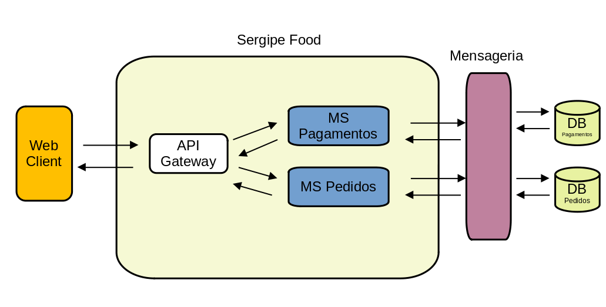

# Sergipe Food

Olá, me chamo Marcelo Viana. Sou estudante interessado em aprender desenvolvimento web.

Ultimamente tenho visto que a arquitetura de microsserviços tem sido protagonista nas escolas de desenvolvimento web de maior referência do Brasil. Tenho conhecimento que esse tipo de arquitetura requer um alto grau de maturidade para ser implementado e não pretendo transmitir nada conclusivo em relação a esse tema.

Com o objetivo de investigar um pouco mais esse universo, criei esse repositório remoto e estou disponibilizando o código fonte do projeto para compartilhar minha experiência e principalmente abrir as portas para dicas e sugestões.

## Levantamento de Requisitos

O projeto consiste em um sistema implementado em arquitetura de microsserviços que utiliza sistemas de service discovery, API gateway e mensageria. O lógica da implementação consiste basicamente em uma comunicação assíncrona onde a criação de um pedido implica na criação de um pagamento e a alteração do status de um pagamento implica na alteração do status de um pedido.

## Proposta do Repositório

A proposta do repositório é disponibilizar o código fonte dos projetos apresentando as lógicas programação utilizadas na implementação dos sistemas.

É importante que, quem tenha interesse em conhecer mais detalhes sobre o projeto, foque em compreender as lógicas de programação utilizadas na implementação, e não tente fazer a portabilidade, pois o projeto não foi configurado com esse objetivo.

Obrigado e fique a vontade para entrar em contato.

marceloviana1991@gmail.com

## Especificações do Projeto

Além dos módulos de microsserviço de pagamentos e de pedidos, o projeto contém mais dois módulos refentes ao service discorery e ao gateway.

Esses dois módulos são compostos por configurações e bibliotecas externas que ficam responsáveis por registrar os microsserviços, realizar balanceamento carga e criar um portão único de entrada para a aplicação.

Já os microsserviços de pagamentos e pedidos, além de possuírem configurações e bibliotecas externas para atuar como clientes do service discorey e do gateway, possuem implementações lógicas de API Rest.

A lógica de integração dos microsserviços é dada por meio de uma relação bidirecional, onde, quando um pedido é criado o microsserviço de pedidos faz uma requisição para o microsserviço de pagamentos e cria um pagamento com status pendente. Já quando um pagamento muda o status de pendente para confirmado o microsserviço de pagamentos faz uma requisição para o microsserviço de pedidos alterando o status do pedido.

O objetivo foi inicialmente implementar uma comunicação síncrona entre os microsserviços para posteriormente implementar uma comunicação assíncrona por meio de sistema de mensageria. A ideia é avaliar as vantagens que esse tipo de comunicação pode trazer para um sistema como esse.

